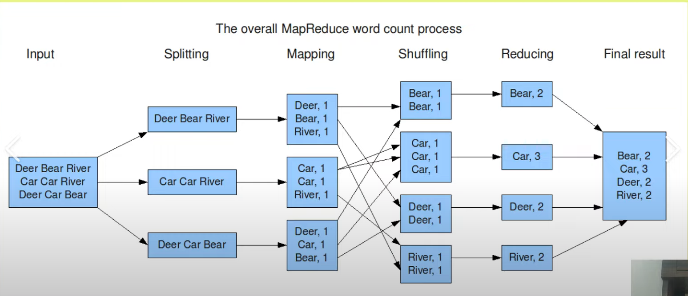
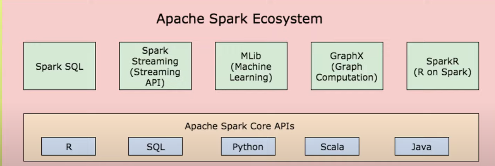
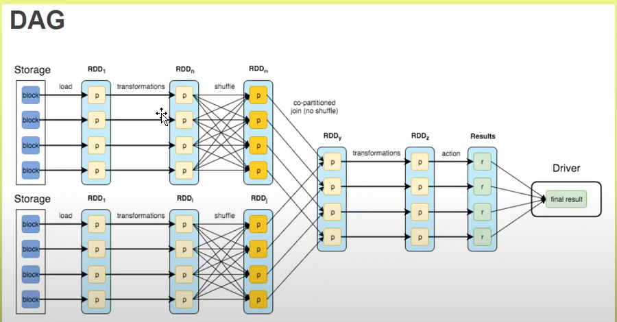
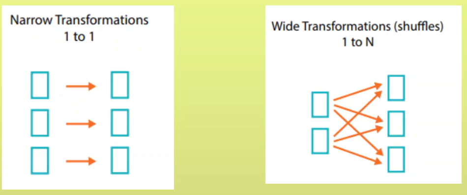
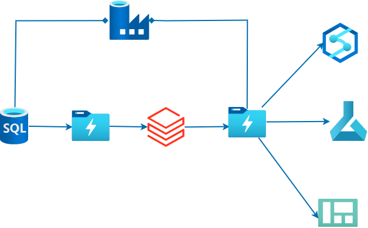

## Background 

>>Similar to Map reduce Apache Spark perform computation in-memory.

>>**Databricks** is unified data analytics platform.

>>It includes 
        1. Interactive notebook
        2. Monitoring tools 
        3. Security Controls

>>It offers three enviornment
        1.  Databricks SQL.
        2.  Databricks Data Science & Engineering.
        3.  Databricks Machine Learning.

JDBC?

>>Overview 
1. Data : store data 
2. Workspace : To manage and share all the resources
3. Compute : 
4. Repos : 
5. Jobs : Run perticular job on time.

>> In notebook we can use %% magic cell to write code in another language. 

## Apache Spark Core Concepts

### Pyspark RDD **DAG**

Spark can accessed by creating RDD's.

But In daytoday life we access it using DataFrame (Python or Scala).

>>Transformation vs Action

Transformation we write logic 

Action : Actual execution of that logic and show resulted output.

>>Wide vs Narrow Transformation

Map > each element get map to one key No Shuffling

Groupby > 1 to n > Wide transformation **involves shuffle**

## Databricks Cluster Creation and Configuration?

>>DBFS: Databricks file System

>>Try not to store anything in DBFS itself

>>Mount storage account adls 

>>Connect to Database >> JDBC

* JDBC (Java Database Connectivity) is an API in Java that enables developers to interact with a database.  
 

* It is part of Java's standard library and provides a standardized way to perform database operations such as querying, updating, and managing relational databases.

>> Delta table

>> Managed vs Unmanaged tables in databricks

>>Vaccum command : to clear older file without reference

>> Merge 2 tables in >>

>> parquet to delta table

