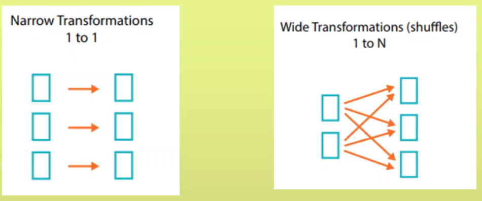

>> ### Spark
*   Spark : Unified computing engine.

*   Spark's worker nodes don't have memory of their own.

>> ### Hadoop vs Spark

*   Hadoop is NOT database.
*   Spark is NOT 100X faster but **upto**.
*   *Misconception* -> Hadoop don't process in RAM.
*   Hadoop was built for batch data processing.
*   Hive -> SQL queries for Hadoop. **STILL DIFFICULT** to code.
*   Spark -> Python, java scala API.
*   *Security* : In Hadoop kerboroes and YARN for authorization and authetication. vs In Spark when it uses HDFS and YARN.
*   Fault Tolerance : HDFS have replication factor usally 3. 

    |     | Hadoop   | Spark    |
    |--------------|--------------|--------------|
    | Fault Tolerance | HDFS have replication factor usally 3. So data will be distributed on 3 nodes  | Spark used **DAG**. For each process it will save an immutable RDD |
    | Security  | YARN and Kerboses | No but used Hadoop's|
    | Why? | Difficult, slow | Easy, fast |

>> ### Why Spark is faster?
It reads from RAM and write in RAM where as Hadoop Read and write on Disk ROM.

>> ### Spark Architecture

 
 

 

>> ### How it works ?

*  Cluster-10 -> 1 : Master Node + 9 : Worker Node

*  Developer will submit code to RM.
with details like
    1.  Driver : 20GB
    2.  excecutor -25 GB and 5 core.
    3.  Number of executor - 5

* *We should not use UDF (Code in pure python), because it will require Python worker to execute and can slow down process.*

*   The **RM** is responsible for managing the cluster resources. (CPU, memory). e.g YARN, Kubernetes.

*   The **Driver** is the main process that runs your Spark application. It is responsible for coordinating the job’s execution and managing the job’s overall lifecycle.

* Each **Executor** is responsible for reading data, performing computations, and storing the results for the tasks assigned to it.

* If the data is stored externally (e.g., in HDFS, S3, or a database), Executor 1 will directly read the data from the source as per the instructions it received from the Driver. 

>> ### Transformation and Action in spark

*   Transformation : we write logic. e.g change name of column, groupby map filter.

*   Action : Actual execution of that logic and show resulted output. e.g count, show, collect.

*   When an action is triggered in Spark, it may cause some or all of the data to be transferred back to the Driver. 

*   If our driver don't have that much memory then 
**driver memory out exception**.

>> ### Wide dependency vs Narrow dependency Transformation

*   Map,filter > each element get map to one key No Shuffling

*   Groupby > 1 to n > Wide transformation involves shuffle which means moving data from 1 partition to another and vice versa.

>> ### DAG and Lazy Evaluation in spark

* If we hit any action spark will create a Job.
* If we excecute transformation it will not create a Job which is called lazy evaluation.
*  Spark builds a DAG of stages representing the sequence of transformations that need to be applied to the data. 

>> ### Spark SQL Engine (catalyst optimizer)

*   Structured API executation.

*   Code in DataframeAPI or SQL ->>> SPARK SQL Enginer ->>> RDD's (Javabyte code).

    >> 4 Phases SPARK SQL ENGINE/Catalyst Optimizer 
    
    1.  Analysis :

    2.  Logical Planning/optimization : optimize/reduce data to read by analyzing all transformation.

    3.  Physical Planning : 

    4.  Code Generation

*   Catalog : Metadata storage for our data.
*   Analysis Exception error : When Spark is unable to read file from catalog. I.e File is not present.

>> ### RDD 

Data will be distributed across cluster/ each excecuter.

Resilient : In case failure it will know how to recover.

RDD's are immutable.

RDD_01 ->> RDD_02 ->> RDD_03

All these steps stored in DAG.

If Spark loses RDD_03 it knows via DAG how to recover it.

>> ### Spark session vs Spark Context.

